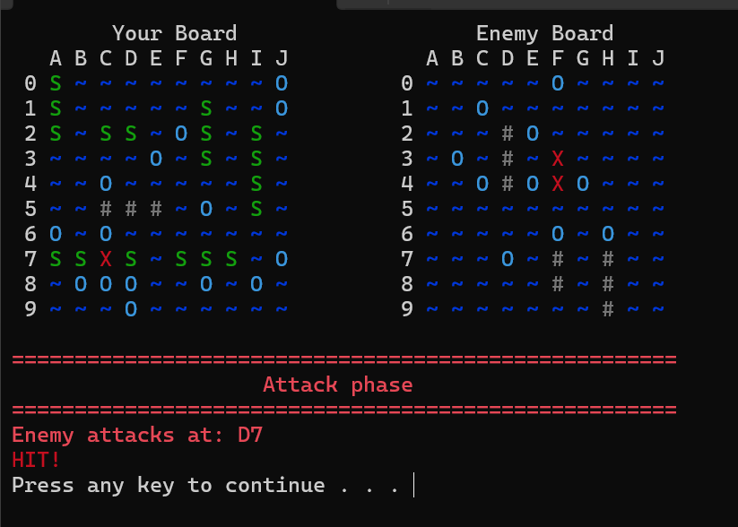
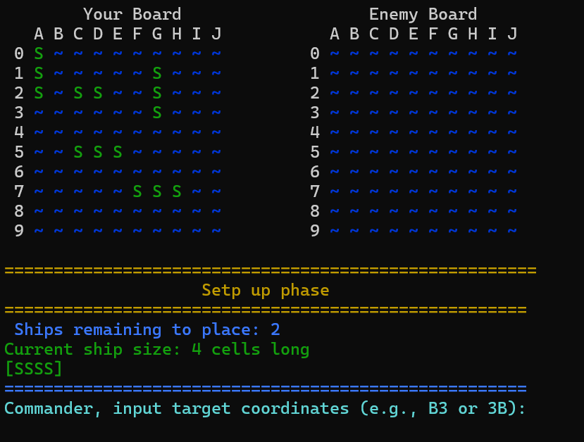
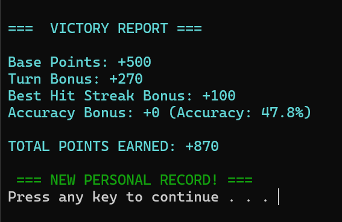
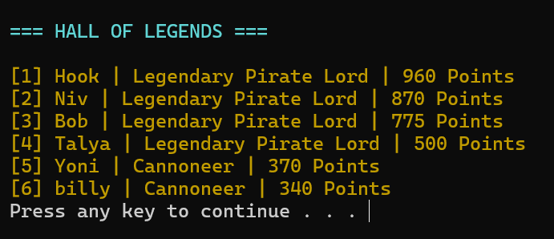
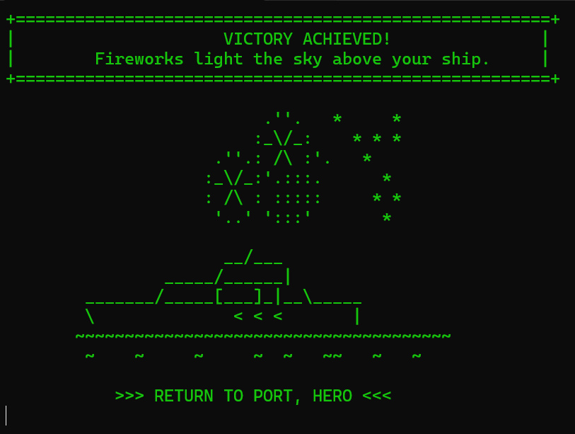

# 🚢 Plunder Cells — Terminal Strategy Game in C

Plunder Cells is a terminal-based submarine strategy game written in C, inspired by classic Battleship mechanics.  
The game focuses on turn-based gameplay, structured system design, and enemy AI with multiple difficulty levels.

This project was developed as part of my first university programming assignment and emphasizes building a complete system from scratch — including game logic, input handling, and modular architecture.

While the game features a light pirate theme, the main focus is on implementing clean code structure, interactive terminal UI, and AI-driven gameplay.

---

## 🧠 Features

- 🚢 Submarine-based strategy gameplay inspired by Battleship  
- 🤖 Enemy AI with 4 difficulty levels (random → targeted behavior after hit)  
- 🎯 Turn-based system with win/lose conditions  
- 🎮 Manual ship placement with rotation and grid preview  
- 🧾 Score system with player tracking  
- 🖥 Full ASCII-based game board with colorful terminal rendering  
- ⚡ Input validation and error handling for stable gameplay  
- 🧩 Modular code structure (gameplay, UI, AI, save/load)  

---

## 📸 Screenshots

### Gameplay
<p align="center">
  
</p>

### Ship Placement
<p align="center">
  
</p>

### Score Board
<p align="center">
  
  
</p>

### Victory Screen
<p align="center">
  
</p>

## ⚙️ How to Run
### Requirements
- Windows OS (uses Windows terminal behavior)
- Visual Studio (recommended)

---
### Run via Git (Recommended)

```bash
git clone https://github.com/naybson/PlunderCells.git

